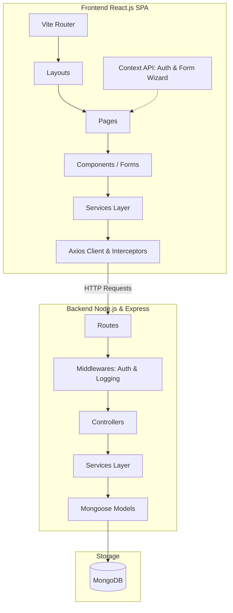
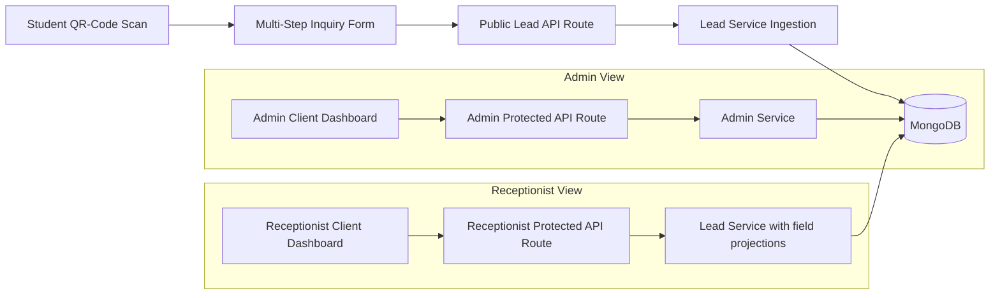

# Coaching Institute Lead Management System

This repository contains the complete production-ready, enterprise-grade folder structure for the **Coaching Institute Lead Management System**. 

The application separates concerns between a React.js single-page application frontend and a Node.js/Express/MongoDB MVC + Service Layer backend. It is designed to capture, validate, and manage student inquiries generated by QR-code scans at coaching institutes.

---

## 1. Project Directory Tree

```text
institute-lead-management/
├── README.md                          # Root project orchestration & developer guide
├── backend/                           # Node.js + Express.js API Service
│   ├── app.js                         # Application entry point (placeholder)
│   ├── package.json                   # Backend metadata and package dependencies
│   ├── .env                           # Local environment config variables
│   ├── config/                        # App configuration parsing modules
│   │   └── README.md
│   ├── database/                      # MongoDB/Mongoose connection manager
│   │   └── README.md
│   ├── models/                        # Mongoose schema definitions
│   │   ├── User/                      # Admin & Receptionist accounts schema
│   │   │   └── README.md
│   │   ├── Lead/                      # Student inquiries schema
│   │   │   └── README.md
│   │   └── Role/                      # RBAC role permissions schema
│   │       └── README.md
│   ├── controllers/                   # Request controllers (routes gateway)
│   │   ├── Auth/                      # Authentication routes controller
│   │   │   └── README.md
│   │   ├── Lead/                      # Lead submission/update controller
│   │   │   └── README.md
│   │   ├── Admin/                     # Admin-only operations controller
│   │   │   └── README.md
│   │   └── Receptionist/              # Receptionist-restricted controller
│   │       └── README.md
│   ├── routes/                        # API Express router endpoints
│   │   ├── auth/                      # /api/auth routes mapper
│   │   │   └── README.md
│   │   ├── lead/                      # /api/leads routes mapper
│   │   │   └── README.md
│   │   ├── admin/                     # /api/admin routes mapper
│   │   │   └── README.md
│   │   └── receptionist/              # /api/receptionist routes mapper
│   │       └── README.md
│   ├── services/                      # Business logic layer
│   │   ├── auth/                      # Sign/verify tokens
│   │   │   └── README.md
│   │   ├── lead/                      # Process leads and enforce data projections
│   │   │   └── README.md
│   │   └── user/                      # User management logic
│   │       └── README.md
│   ├── middleware/                    # Interceptors
│   │   ├── authentication/            # JWT verification middleware
│   │   │   └── README.md
│   │   ├── authorization/             # Role authorization middleware
│   │   │   └── README.md
│   │   ├── errorHandler/              # Centralized global Express error handler
│   │   │   └── README.md
│   │   └── logger/                    # HTTP & system logger middleware (Morgan/Winston)
│   │       └── README.md
│   ├── validators/                    # Request payload validator schemas (Zod/Joi)
│   │   └── README.md
│   ├── utils/                         # Reusable helpers & utilities
│   │   └── README.md
│   ├── constants/                     # Shared static constants and enumerations
│   │   └── README.md
│   ├── docs/                          # Swagger specifications & system design assets
│   │   └── README.md
│   ├── uploads/                       # Temporary folder for file uploads
│   │   └── README.md
│   └── logs/                          # Error and activity log files
│       └── README.md
│
└── frontend/                          # React.js client application
    ├── package.json                   # Frontend npm package dependencies & scripts
    ├── README.md                      # Frontend architecture guide
    ├── public/                        # Static HTML and favicon assets
    └── src/                           # Source files
        ├── assets/                    # Shared image, icon, and logo resources
        ├── api/                       # Axios Client config & default interceptors
        │   └── README.md
        ├── services/                  # Component API call wrappers (Auth, Lead, User)
        │   └── README.md
        ├── hooks/                     # Custom React Hooks (useAuth, useFormWizard)
        │   └── README.md
        ├── context/                   # Context Providers (AuthContext, LeadFormContext)
        │   └── README.md
        ├── layouts/                   # Layout wrappers (AdminLayout, FormLayout)
        │   └── README.md
        ├── routes/                    # React Router definitions & Guard components
        │   └── README.md
        ├── pages/                     # Full page components
        │   ├── README.md
        │   ├── auth/                  # Login pages
        │   ├── admin/                 # Admin management page
        │   ├── receptionist/          # Receptionist dashboard page
        │   └── form/                  # Lead Form wizard page
        ├── components/                # Reusable presentation components
        │   └── README.md
        ├── dashboard/                 # Shared dashboard subcomponents & widgets
        │   └── README.md
        ├── forms/                     # Multi-Step lead wizard modules
        │   ├── README.md
        │   ├── Step1/                 # Basic Info form step
        │   ├── Step2/                 # Course Info form step
        │   ├── Step3/                 # Additional Info form step
        │   ├── Review/                # Aggregate fields review screen
        │   └── Success/               # Form completion success screen
        ├── admin/                     # Admin-only presentation components
        │   └── README.md
        ├── receptionist/              # Receptionist-only presentation components
        │   └── README.md
        ├── validations/               # Client validation schemas (Zod/Yup)
        │   └── README.md
        ├── constants/                 # Routing constants & Form lists (courses, classes)
        │   └── README.md
        ├── styles/                    # Global stylesheets & theme variables
        │   └── README.md
        └── utils/                     # Formatting and caching helper scripts
            └── README.md
```

---

## 2. Folder-wise Explanation

### Backend Subdirectories
*   **`config/`**: Contains application configuration files. Exposes environmental configs through structured ES Modules so the rest of the application never accesses `process.env` directly.
*   **`database/`**: Initializes database connection hooks. Houses database seeding scripts that establish default administrative roles and credentials.
*   **`models/`**: Declares MongoDB schemas using Mongoose. Divided into subfolders representing core entities: `User` (credentials, profile info), `Lead` (the student's multi-step inquiry data), and `Role` (permissions for Admin and Receptionist).
*   **`controllers/`**: Extracts data from HTTP requests, calls the corresponding business services, and formats JSON responses. Organizes actions by roles and features.
*   **`routes/`**: Bridges HTTP endpoints to corresponding controllers. Handled by role-based route routers (`auth`, `lead`, `admin`, `receptionist`) and secured via authorization middlewares.
*   **`services/`**: The core **business logic layer**. Evaluates database inquiries, signs tokens, and processes leads. Crucially, the Lead service filters field projection when returning lead details to receptionist queries.
*   **`middleware/`**: Functions that execute in the request-response cycle. Handles JWT decoding (`authentication`), RBAC checks (`authorization`), system/network logging (`logger`), and exception handling (`errorHandler`).
*   **`validators/`**: Enforces strict payload request shape and content validations (e.g. email pattern, valid class selections) prior to hitting controllers.
*   **`utils/`**: Reusable modules like date helper libraries, log formatters, and custom HTTP error extensions.
*   **`constants/`**: Static configuration values, application enums (e.g., student classes, batches), and standard HTTP messages.
*   **`docs/`**: Holds API design structures such as Swagger JSON files, system block diagrams, and Postman API exports.

### Frontend Subdirectories
*   **`api/`**: Configures the Axios connection, setting base request URLs and attaching request/response interceptors to handle automatic JWT headers and handle session expiration.
*   **`services/`**: Exposes modular, asynchronous functions executing remote API calls to backend routes.
*   **`hooks/`**: Custom React hooks encapsulation, ensuring components don't store redundant stateful helper code (e.g., handling form step sequences or tracking authentication cookies).
*   **`context/`**: Employs React Context to distribute state. `AuthContext` distributes credentials; `LeadFormContext` aggregates wizard step fields.
*   **`layouts/`**: Outlines common layout wrappers containing navigation, sidebars, and main content frames (e.g., `AdminLayout`, `FormLayout`).
*   **`routes/`**: Declares application routing rules. Houses route-guards (e.g. `AdminRoute`) to protect receptionist/admin views from illegal access.
*   **`pages/`**: The top-level pages mapped by routing configurations, acting as containers that assemble modules and components.
*   **`components/`**: Reusable, pure presentation widgets (buttons, dropdown fields, tables, alerts).
*   **`forms/`**: Contains the wizard components for student lead registrations. Handles progress indicators, steps transition logic, field validations, and final review/success states.
*   **`admin/` / `receptionist/`**: Domain-specific components tailored for either role (e.g., receptionist lead listings vs. admin user management logs).
*   **`validations/`**: Schema-based validations (using libraries like Zod/Yup) to prevent submission of invalid data from the client UI.
*   **`styles/`**: Defines global theme variables (colors, fonts, grids, animations).
*   **`utils/`**: Simple formatting utility scripts.

---

## 3. Architecture Overview



### Key Architectural Characteristics
1.  **Clear Separation of Concerns**: The frontend and backend act as completely separate entities. They communicate solely through RESTful JSON APIs.
2.  **Service-Oriented MVC**: Controllers in the backend act as traffic controllers. They validate schemas and forward requests to the service layer. The **Service Layer** handles the business rules, data filtering, database interactions, and authorization checks.
3.  **Role-Based Access Control (RBAC)**: Enforced both on the client (via route guards and conditional component rendering) and securely on the API backend (via JWT inspection middleware and role-restricted routes).
4.  **Security via Data Projections**: To meet the requirement where *Receptionists can only view Name, Email, and Contact Number* while *Admins can view all info*, the backend Lead Service enforces MongoDB projection query rules depending on the authenticated user's role.

---

## 4. Module Dependency Overview



- **Authentication Module**: Standardizes user authorization. Routes and layouts depend on the token payload issued by the Auth Service.
- **Lead Ingestion Module**: Students interact with this module anonymously. Submissions pass through the `LeadController` directly to MongoDB.
- **Receptionist Lead Management Module**: Pulls list view leads. It depends on token role validation. Database query strictly limits returning columns, preventing leak of queries/remarks.
- **Admin Management Module**: Exposes all lead attributes, user controls, and reporting analytics. It has zero dependency constraints.

---

## 5. Development Guidelines

### General Code Quality Rules
- **No Direct Environment Reference**: Always load configurations from the `backend/config` module.
- **Async/Await Error Handling**: Wrap async controllers in an async handler helper to propagate errors automatically to the global error middleware.
- **Validations First**: Perform input validations in both layers: frontend validation using schema validators, backend validation prior to database interaction.

### Git & Deployment Workflow
- Organize branches: `main` (production), `develop` (staging/integration), and feature branches (`feature/feature-name`).
- Frontend development: Run `npm run dev` from the `frontend/` directory.
- Backend development: Run `npm run dev` from the `backend/` directory to trigger nodemon hot reloading.
