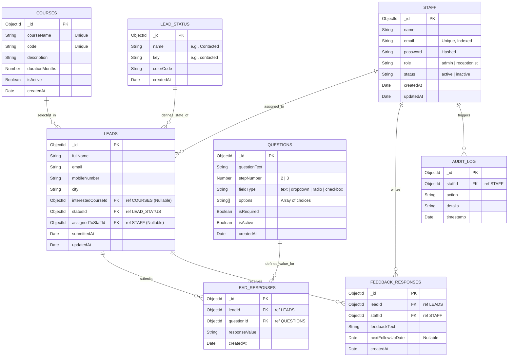

# Custom Database Design & Entity Relationship (ER) Diagram

This document describes the schema design, field definitions, and relationships for the customized Coaching Institute Lead Management System database.

---

## 1. Entity-Relationship (ER) Diagram

Below is the updated ER diagram mapping out the 8 requested collections: `staff`, `courses`, `lead_status`, `leads`, `questions`, `lead_responses`, `feedback_responses`, and `audit_log`.

---

## 2. Collection Schema Specifications

### A. Staff Collection (`staff`)
Contains employee records (Admins and Receptionists).
*   **Unique Index**: `email` (forces unique logins).

| Field Name | Type | Constraints | Description |
| :--- | :--- | :--- | :--- |
| `_id` | ObjectId | PK | Unique staff identifier |
| `name` | String | Required | Full name |
| `email` | String | Unique, Indexed, Required | Corporate email address |
| `password` | String | Required | Encrypted password hash |
| `role` | String | Required | Enum: `admin`, `receptionist` |
| `status` | String | Required | Enum: `active`, `inactive` |
| `createdAt` | Date | Default: Now | Account creation date |
| `updatedAt` | Date | Default: Now | Last profile update date |

### B. Courses Collection (`courses`)
Stores details of the subjects and programs offered by the institute.

| Field Name | Type | Constraints | Description |
| :--- | :--- | :--- | :--- |
| `_id` | ObjectId | PK | Unique course identifier |
| `courseName` | String | Unique, Required | Course title (e.g. "JEE Prep") |
| `code` | String | Unique, Required | Course shorthand code (e.g. "JEE-01") |
| `description` | String | Optional | Curriculum summary |
| `durationMonths`| Number | Required | Study timeline length |
| `isActive` | Boolean | Default: true | Course availability toggle |
| `createdAt` | Date | Default: Now | Insertion timestamp |

### C. Lead Status Collection (`lead_status`)
Defines the lifecycles state a student inquiry goes through.

| Field Name | Type | Constraints | Description |
| :--- | :--- | :--- | :--- |
| `_id` | ObjectId | PK | Unique status identifier |
| `name` | String | Unique, Required | Display label (e.g. "Contacted") |
| `key` | String | Unique, Required | System identifier key (e.g. "contacted") |
| `colorCode` | String | Required | Hex color code for dashboard indicators |
| `createdAt` | Date | Default: Now | Creation date |

### D. Leads Collection (`leads`)
Core student records captured during Step 1 of the QR code inquiry form.

| Field Name | Type | Constraints | Description |
| :--- | :--- | :--- | :--- |
| `_id` | ObjectId | PK | Unique lead identifier |
| `fullName` | String | Required | Student full name |
| `email` | String | Required | Contact email |
| `mobileNumber` | String | Required, Indexed | Contact mobile phone |
| `city` | String | Required | Residency city |
| `interestedCourseId`| ObjectId | FK ref `courses`, Nullable | Linked course selection |
| `statusId` | ObjectId | FK ref `lead_status`, Required | References current pipeline status |
| `assignedToStaffId` | ObjectId | FK ref `staff`, Nullable | Receptionist managing calls |
| `submittedAt` | Date | Default: Now | Date inquiry submitted |
| `updatedAt` | Date | Default: Now | Last edit timestamp |

### E. Questions Collection (`questions`)
Stores dynamically configured questions for Step 2 and Step 3 of the form. Allows the institute to update questions without modifying database schemas.

| Field Name | Type | Constraints | Description |
| :--- | :--- | :--- | :--- |
| `_id` | ObjectId | PK | Unique question identifier |
| `questionText` | String | Required | The question (e.g., "What is your qualification?") |
| `stepNumber` | Number | Required | Enum: `2`, `3` |
| `fieldType` | String | Required | Enum: `text`, `dropdown`, `radio`, `checkbox` |
| `options` | Array[String]| Required when fieldType is choice-based | List of selection items |
| `isRequired` | Boolean | Default: false | Form validator requirement check |
| `isActive` | Boolean | Default: true | If inactive, form excludes it |
| `createdAt` | Date | Default: Now | Creation date |

### F. Lead Responses Collection (`lead_responses`)
Stores the student's dynamic answers to the questions inside Step 2 and Step 3.

| Field Name | Type | Constraints | Description |
| :--- | :--- | :--- | :--- |
| `_id` | ObjectId | PK | Unique response identifier |
| `leadId` | ObjectId | FK ref `leads`, Required | Reference to the student |
| `questionId` | ObjectId | FK ref `questions`, Required | Reference to the specific question |
| `responseValue` | String | Required | Student's submitted text/value |
| `createdAt` | Date | Default: Now | Submission timestamp |

### G. Feedback Responses Collection (`feedback_responses`)
Maintains staff-written call feedback, tracking remarks and future appointment logs for the student.

| Field Name | Type | Constraints | Description |
| :--- | :--- | :--- | :--- |
| `_id` | ObjectId | PK | Unique feedback entry ID |
| `leadId` | ObjectId | FK ref `leads`, Required | Lead being evaluated |
| `staffId` | ObjectId | FK ref `staff`, Required | Admin or Receptionist writing feedback |
| `feedbackText` | String | Required | Content of review / call summary |
| `nextFollowUpDate`| Date | Nullable | Scheduled next callback calendar date |
| `createdAt` | Date | Default: Now | Logging timestamp |

### H. Audit Log Collection (`audit_log`)
Monitors application processes for security compliance.

| Field Name | Type | Constraints | Description |
| :--- | :--- | :--- | :--- |
| `_id` | ObjectId | PK | Unique audit log ID |
| `staffId` | ObjectId | FK ref `staff`, Required | User triggering the log |
| `action` | String | Required | Name of operation (e.g., `LEAD_DELETE`) |
| `details` | String | Required | Detailed description of action |
| `timestamp` | Date | Default: Now | Occurrence timestamp |
