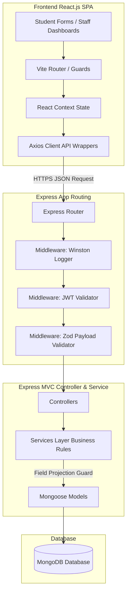
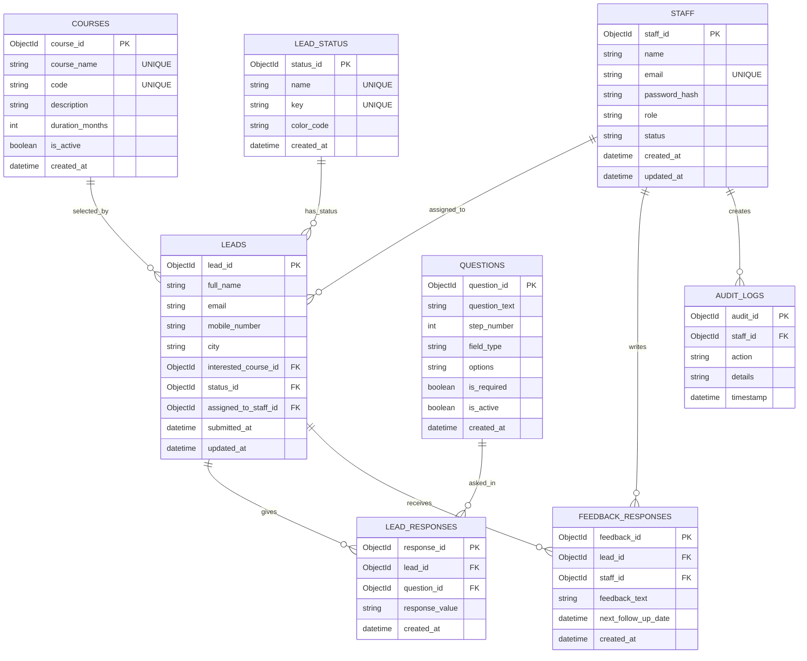

# System Architecture, Tech Stack, & Database Specifications

This document serves as the absolute blueprint for the **Coaching Institute Lead Management System**. It outlines the technology stack, system architecture flows, and the advanced database design including the Entity-Relationship (ER) model.

---

## 1. Technology Stack Specification

| Component | Technology | Version | Purpose & Core Responsibility |
| :--- | :--- | :--- | :--- |
| **Frontend** | React.js (Vite) | 18.x | Dynamic, responsive Single Page Application (SPA). Manages student wizard form steps, staff logins, and dashboards. |
| **Styling** | Vanilla CSS | CSS3 | Custom variables and responsive layouts utilizing modern design specs (dark modes, micro-animations, clean grids). |
| **Backend** | Node.js + Express.js | 20.x | RESTful API backend handling route security, request validation, and database orchestration. |
| **Database** | MongoDB | 7.0+ | Document-based NoSQL database chosen for its JSON-friendly dynamic schema structure. |
| **ORM** | Mongoose | 8.x | Object Data Modeling (ODM) library for schema enforcement and MongoDB relationships in Node.js. |
| **Client Validation**| Zod / Yup | - | Form validation inside the React wizard before payload submission. |
| **Server Validation**| Zod / Joi | - | Enforces payload schemas at Express entry routing. |
| **Security** | JWT (JSON Web Tokens) | - | Statless session authorization for Admin and Receptionist logins. |

---

## 2. System Architecture

The project is designed using the **MVC + Service Layer** pattern. Business logic is strictly separated from request handling.



### Flow Separation Rules
1.  **Strict Security Field Projection**: 
    When a Receptionist requests lead details, the `LeadService` applies a Mongoose projection filter (`select('fullName email mobileNumber status')`). Sensitive student details (remarks, queries, career goals) never leave the database, preventing network-sniffing leaks.
2.  **Stateless Session Control**: 
    Express uses stateless JWT verification. Upon a successful login, the `staff` member gets a token payload containing their unique role, checked during authorization middleware processing.

---

## 3. Database Entity-Relationship (ER) Diagram

The system employs a **hybrid dynamic design** containing the following 8 collections. It allows the multi-step form's Step 2 and Step 3 questions to be fully configured in the database, meaning new questions can be added by an admin without changing the database schema.



---

## 4. Collection Schemas & Configurations

### STAFF (`staff`)
Stores administrative personnel login details.
*   **Indices**: Unique index on `email`.

```json
{
  "staff_id": "ObjectId (PK)",
  "name": "String",
  "email": "String (Unique)",
  "password_hash": "String (Bcrypt Hash)",
  "role": "String",
  "status": "String",
  "created_at": "Date",
  "updated_at": "Date"
}
```

### COURSES (`courses`)
Stores course offerings.
*   **Indices**: Unique index on `code`, `course_name`.

```json
{
  "course_id": "ObjectId (PK)",
  "course_name": "String (Unique)",
  "code": "String (Unique)",
  "description": "String",
  "duration_months": "Number",
  "is_active": "Boolean",
  "created_at": "Date"
}
```

### LEAD_STATUS (`lead_status`)
Pipeline status states.

```json
{
  "status_id": "ObjectId (PK)",
  "name": "String (Unique)",
  "key": "String (Unique)",
  "color_code": "String (Hex)",
  "created_at": "Date"
}
```

### LEADS (`leads`)
Core inquiry documents generated at Step 1 of form completion.
*   **Indices**: Compound index `{ mobile_number: 1, email: 1 }` to block duplicates. Index on `assigned_to_staff_id` and `status_id`.

```json
{
  "lead_id": "ObjectId (PK)",
  "full_name": "String",
  "email": "String",
  "mobile_number": "String",
  "city": "String",
  "interested_course_id": "ObjectId (ref courses, Nullable)",
  "status_id": "ObjectId (ref lead_status)",
  "assigned_to_staff_id": "ObjectId (ref staff, Nullable)",
  "submitted_at": "Date",
  "updated_at": "Date"
}
```

### QUESTIONS (`questions`)
Stores question fields shown inside Step 2 and Step 3.

```json
{
  "question_id": "ObjectId (PK)",
  "question_text": "String",
  "step_number": "Number (2 | 3)",
  "field_type": "String (text | dropdown | radio | checkbox)",
  "options": "String",
  "is_required": "Boolean",
  "is_active": "Boolean",
  "created_at": "Date"
}
```

### LEAD_RESPONSES (`lead_responses`)
Stores the dynamic answers to student questions.
*   **Indices**: Compound index `{ lead_id: 1, question_id: 1 }` (guarantees a single answer per question per student).

```json
{
  "response_id": "ObjectId (PK)",
  "lead_id": "ObjectId (ref leads)",
  "question_id": "ObjectId (ref questions)",
  "response_value": "String",
  "created_at": "Date"
}
```

### FEEDBACK_RESPONSES (`feedback_responses`)
Follow-up log detailing telephone conversations, notes, and callbacks.
*   **Indices**: Index on `lead_id`, `next_follow_up_date`.

```json
{
  "feedback_id": "ObjectId (PK)",
  "lead_id": "ObjectId (ref leads)",
  "staff_id": "ObjectId (ref staff)",
  "feedback_text": "String",
  "next_follow_up_date": "Date (Nullable)",
  "created_at": "Date"
}
```

### AUDIT_LOGS (`audit_logs`)
Monitors sensitive operations.
*   **Indices**: TTL Index on `timestamp` (auto-delete logs older than 90 days).

```json
{
  "audit_id": "ObjectId (PK)",
  "staff_id": "ObjectId (ref staff)",
  "action": "String (e.g. LEAD_EXPORT)",
  "details": "String",
  "timestamp": "Date"
}
```

---

## 5. Query Tuning & Performance

To optimize database access, developers must execute queries using index prefix rules:
1.  **Preventing In-Memory Sorts**:
    Any listing queried for receptionist lists must be sorted using an existing index path to avoid MongoDB's 32MB sort limit:
    *   Index configuration: `db.leads.createIndex({ assigned_to_staff_id: 1, submitted_at: -1, status_id: 1 })`
    *   Query structure: `db.leads.find({ assigned_to_staff_id: id }).sort({ submitted_at: -1 })`
2.  **Partial Index for Unassigned Leads**:
    Since unassigned leads are frequently queried for redirection:
    *   Index configuration: `db.leads.createIndex({ submitted_at: -1 }, { partialFilterExpression: { assigned_to_staff_id: { $exists: false } } })`
.

+--- .gitignore

+--- backend

|   +--- app.js

|   +--- config

|   |   \--- README.md

|   +--- constants

|   |   \--- README.md

|   +--- controllers

|   |   +--- Admin

|   |   |   +--- README.md

|   |   |   \--- statsController.js

|   |   +--- Auth

|   |   |   +--- authController.js

|   |   |   \--- README.md

|   |   +--- Lead

|   |   |   +--- courseController.js

|   |   |   +--- leadController.js

|   |   |   +--- questionController.js

|   |   |   \--- README.md

|   |   \--- Receptionist

|   |       \--- README.md

|   +--- database

|   |   +--- README.md

|   |   \--- store.js

|   +--- docs

|   |   \--- database_er_diagram.md

|   +--- logs

|   |   \--- README.md

|   +--- middleware

|   |   +--- authentication

|   |   |   +--- authMiddleware.js

|   |   |   \--- README.md

|   |   +--- authorization

|   |   |   +--- README.md

|   |   |   \--- roleMiddleware.js

|   |   +--- errorHandler

|   |   |   +--- errorHandler.js

|   |   |   \--- README.md

|   |   \--- logger

|   |       \--- README.md

|   +--- models

|   |   +--- Course

|   |   |   \--- README.md

|   |   +--- Fee

|   |   |   \--- README.md

|   |   +--- Lead

|   |   |   \--- README.md

|   |   +--- Payment

|   |   |   \--- README.md

|   |   +--- Role

|   |   |   \--- README.md

|   |   \--- User

|   |       \--- README.md

|   +--- package-lock.json

|   +--- package.json

|   +--- routes

|   |   +--- admin

|   |   |   \--- README.md

|   |   +--- admin.js

|   |   +--- auth

|   |   |   \--- README.md

|   |   +--- auth.js

|   |   +--- courses.js

|   |   +--- lead

|   |   |   \--- README.md

|   |   +--- leads.js

|   |   +--- questions.js

|   |   \--- receptionist

|   |       \--- README.md

|   +--- services

|   |   +--- admin

|   |   |   \--- README.md

|   |   +--- auth

|   |   |   \--- README.md

|   |   +--- fee

|   |   |   \--- README.md

|   |   +--- lead

|   |   |   \--- README.md

|   |   +--- payment

|   |   |   \--- README.md

|   |   \--- user

|   |       \--- README.md

|   +--- utils

|   |   \--- README.md

|   \--- validators

|       \--- README.md

+--- frontend

|   +--- components.json

|   +--- index.html

|   +--- jsconfig.json

|   +--- package-lock.json

|   +--- package.json

|   +--- postcss.config.js

|   +--- public

|   +--- README.md

|   +--- src

|   |   +--- admin

|   |   |   +--- AdminDashboard.jsx

|   |   |   +--- components

|   |   |   |   +--- DiscountManagement.jsx

|   |   |   |   +--- FeeDashboard.jsx

|   |   |   |   +--- FeeRules.jsx

|   |   |   |   +--- FeeStructure.jsx

|   |   |   |   +--- Reports.jsx

|   |   |   |   \--- settings

|   |   |   |       \--- AdminSettings.jsx

|   |   |   \--- README.md

|   |   +--- api

|   |   |   +--- api.js

|   |   |   \--- README.md

|   |   +--- App.jsx

|   |   +--- assets

|   |   |   +--- Droneco.jpg

|   |   |   \--- DroneCo_Logo-copy.png

|   |   +--- components

|   |   |   +--- README.md

|   |   |   \--- ui

|   |   |       +--- badge.jsx

|   |   |       +--- button.jsx

|   |   |       +--- card.jsx

|   |   |       +--- dialog.jsx

|   |   |       +--- dropdown-menu.jsx

|   |   |       +--- input.jsx

|   |   |       +--- select.jsx

|   |   |       +--- table.jsx

|   |   |       +--- tabs.jsx

|   |   |       +--- toast.jsx

|   |   |       \--- toaster.jsx

|   |   +--- constants

|   |   |   \--- README.md

|   |   +--- context

|   |   |   +--- AuthContext.jsx

|   |   |   \--- README.md

|   |   +--- forms

|   |   |   +--- README.md

|   |   |   +--- Review

|   |   |   |   \--- index.jsx

|   |   |   +--- Step1

|   |   |   |   \--- index.jsx

|   |   |   +--- Step2

|   |   |   |   \--- index.jsx

|   |   |   +--- Step3

|   |   |   |   \--- index.jsx

|   |   |   +--- StudentForm.jsx

|   |   |   \--- Success

|   |   |       \--- index.jsx

|   |   +--- hooks

|   |   |   +--- README.md

|   |   |   \--- use-toast.js

|   |   +--- index.css

|   |   +--- layouts

|   |   |   +--- AppLayout.jsx

|   |   |   +--- PageHeader.jsx

|   |   |   +--- README.md

|   |   |   \--- Sidebar.jsx

|   |   +--- lib

|   |   |   \--- utils.js

|   |   +--- main.jsx

|   |   +--- pages

|   |   |   +--- admin

|   |   |   +--- auth

|   |   |   |   \--- Login.jsx

|   |   |   +--- form

|   |   |   +--- README.md

|   |   |   \--- receptionist

|   |   +--- receptionist

|   |   |   +--- components

|   |   |   |   +--- admissions

|   |   |   |   |   \--- AdmissionWizard.jsx

|   |   |   |   +--- CollectFee.jsx

|   |   |   |   +--- DueList.jsx

|   |   |   |   +--- PaymentHistory.jsx

|   |   |   |   +--- ReceiptPage.jsx

|   |   |   |   +--- ReceptionDashboard.jsx

|   |   |   |   +--- settings

|   |   |   |   |   \--- ReceptionSettings.jsx

|   |   |   |   +--- StudentLeads.jsx

|   |   |   |   +--- students

|   |   |   |   |   +--- StudentProfile.jsx

|   |   |   |   |   \--- StudentsList.jsx

|   |   |   |   \--- StudentSearch.jsx

|   |   |   +--- README.md

|   |   |   \--- ReceptionistDashboard.jsx

|   |   +--- routes

|   |   |   \--- README.md

|   |   +--- services

|   |   |   \--- README.md

|   |   +--- styles

|   |   |   \--- README.md

|   |   +--- utils

|   |   |   +--- README.md

|   |   |   \--- toast.js

|   |   \--- validations

|   |       \--- README.md

|   +--- tailwind.config.js

|   \--- vite.config.js

+--- gen_structure.js

+--- README.md

\--- system_architecture_design.md

