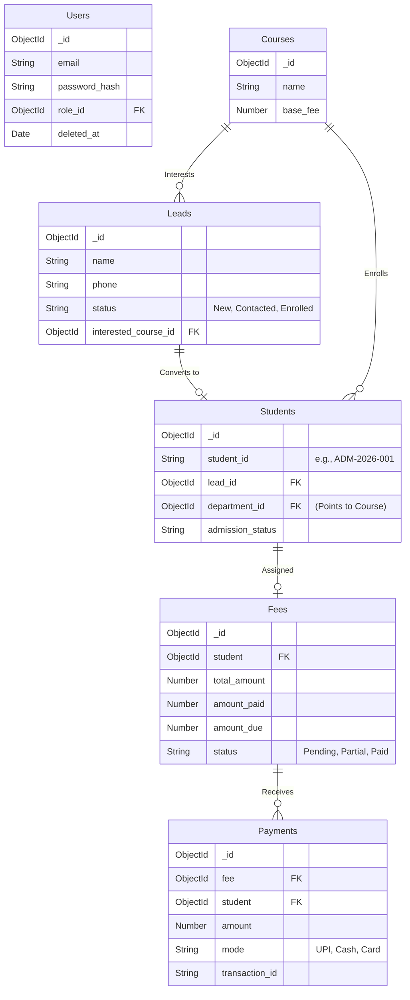

# System Architecture & Design

## 1. High-Level Architecture

The **Droneco Lead Management System** follows a decoupled client-server architecture:
- **Frontend:** A React SPA served statically (via Render).
- **Backend:** A Node.js/Express REST API serving JSON (via Render).
- **Database:** MongoDB (via Render or Atlas) acting as the single source of truth.

## 2. Directory Structure (MVC Architecture)

The backend is structured using the standard Model-View-Controller (MVC) architectural pattern, separating concerns based on their technical function.

```text
backend/src/
├── models/         # Mongoose Schemas (Data Layer & Business Rules)
├── controllers/    # Business Logic and Request Handlers
├── routes/         # Express Routers (API Endpoints & View Layer)
├── utils/          # Shared helper functions and utilities
└── middleware/     # Custom Express middleware (Auth, Error Handling, etc.)
```

This structure organizes files by their role:
- **Models (`models/*.model.js`)**: Define the structure of the data and interact directly with the MongoDB database. They may also contain pre-save hooks and data sanitization logic.
- **Controllers (`controllers/*.controller.js`)**: Contain the core business logic, handle transactions, process incoming requests, and return appropriate responses.
- **Routes (`routes/*.routes.js`)**: Map HTTP methods and endpoints to specific controller functions.
- **Validation**: Zod or Joi schemas are typically used at the route or controller level to validate incoming request payloads.

## 3. Database Schema & ERD

The core data flow moves a prospect from a **Lead** to an enrolled **Student**, which triggers the creation of financial records (**Fee** and **Payment**). 

Soft deletes (`deleted_at`) are implemented across major collections to ensure historical data preservation.



## 4. Core Business Flows

### Admission Wizard Flow (Transaction-Safe)
Admitting a student is the most complex operation in the system. Because it touches multiple collections, it is wrapped in a **MongoDB Session Transaction**. If any step fails, the entire database state rolls back.

1. **Client Submission:** Receptionist submits the final step of the admission wizard.
2. **Transaction Start:** Controller opens a Mongoose `session.startTransaction()`.
3. **Student Generation:** Generates a structured ID (e.g., `DRN2026XXXX`) and creates the `Student` document referencing the `Course`.
4. **Fee Initialization:** Queries the selected `Course` base fee, applies applicable taxes/discounts, and creates a `Fee` document linked to the `Student`.
5. **Initial Payment (Optional):** If the user pays an upfront fee, a `Payment` document is created and the `Fee` balance is updated.
6. **Transaction Commit:** `session.commitTransaction()` executes all inserts atomically.

## 5. Security, Validation & Third-Party Integrations

- **Authentication (MongoDB & JWT):** A fully secure authentication system is implemented using MongoDB to store user credentials (hashed). Stateless JWT tokens are passed via the `Authorization: Bearer <token>` header for session management.
- **Media Asset Storage (Cloudinary):** User-uploaded assets like profile photos, ID proofs, and signatures are securely uploaded to **Cloudinary** via a protected `multer` endpoint. Only authenticated staff can upload media, preventing public endpoints from being abused.
- **Zod Validation:** Request payloads are validated at the router level before hitting controllers.
- **RBAC Middleware:** Routes are protected by `authorize('Admin', 'Receptionist')` wrappers.
- **Data Sanitization:** `express-mongo-sanitize` scrubs `$where` and other malicious injection vectors from req.body/params.
